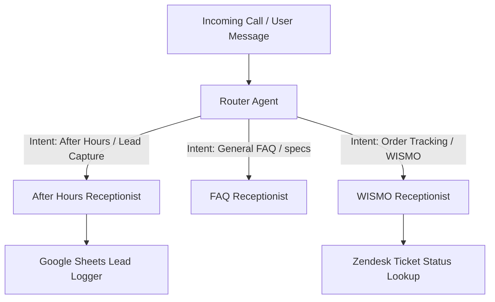

# Ariel Bath AI Receptionist SOP

This document defines the architecture, files, endpoints, schemas, and guidelines for the decoupled Ariel Bath AI Receptionist system. It excludes legacy swarm orchestration details to serve as a clean source of truth for the receptionist product.

*Back to **[Workspace Dashboard](file:///home/dnguyen029/telemetry-dashboard/.agents/docs/dashboard.md)***

---

## 🎯 System Architecture

The receptionist system handles incoming customer calls/messages via a Root Router, delegating to specialized agents based on user intent:

---

## 📁 File Registry

All files relevant to the Receptionist system are organized below:

### 1. Agent Directives (Prompts)

* **[After Hours Receptionist](file:///home/dnguyen029/telemetry-dashboard/.agents/agents/receptionist.txt)**: Prompt instructing lead-capture behavior. [ACTIVE]
* **[Router Agent](file:///home/dnguyen029/telemetry-dashboard/.agents/agents/router.txt)**: Prompt for intent classification and subagent delegation. [ACTIVE] *(CRITICAL: The `{@AGENT: [Name]}` tags inside router.txt MUST exactly match the Display Names configured in the CES GUI, e.g., `{@AGENT: After Hours Specialist}`, NOT internal variable names, or CES will throw a strict validation error!)*
* **[FAQ Receptionist](file:///home/dnguyen029/telemetry-dashboard/.agents/agents/faq_receptionist.txt)**: Prompt for answering product/brand specifications. [ACTIVE]
* **[WISMO Receptionist](file:///home/dnguyen029/telemetry-dashboard/.agents/agents/wismo_receptionist.txt)**: Prompt for PO lookup and ticket status check. [ACTIVE]

### 2. Integration Tools & Code

* **[Lead Logger (Sheets)](file:///home/dnguyen029/telemetry-dashboard/app_build/receptionist/app/tools_lib/sheets.py)**: Production Python tool handling lead uploads to Google Sheets.
* **[Zendesk Integration](file:///home/dnguyen029/telemetry-dashboard/app_build/receptionist/app/tools_lib/zendesk.py)**: Production Python tool handling Zendesk ticket searches, updates, and creation.
* **[Execution Entrypoint](file:///home/dnguyen029/telemetry-dashboard/app_build/receptionist/app/tools.py)**: Production tools wrapper routing lead logging and WISMO lookup.
* **[Legacy Webhook Simulation](file:///home/dnguyen029/telemetry-dashboard/app_build/main.py)**: Root simulator webhook for offline testing.
* **[Simulator Sheets Logger](file:///home/dnguyen029/telemetry-dashboard/app_build/tools/sheets.py)**: Duplicate sheets client configured specifically for local simulation testing via the `main.py` entrypoint. Note: Any changes to Google Sheets schemas or row indices MUST be updated in both files to keep them in sync.

## 🚀 Updating & Deploying the Receptionist

Because this system runs on a **hybrid architecture** (ADK Reasoning Engine + Dialogflow CX Generative Agents), modifying the text files locally does **NOT** automatically update the live phone number. 

There are **two independent deployment steps** required whenever you modify a prompt (e.g., [router.txt](file:///home/dnguyen029/telemetry-dashboard/.agents/agents/router.txt) or [receptionist.txt](file:///home/dnguyen029/telemetry-dashboard/.agents/agents/receptionist.txt)):

### 1. Update the ADK Backend (Reasoning Engine)
1. **Navigate**: `cd /home/dnguyen029/telemetry-dashboard/app_build/receptionist`
2. **Trigger**: Execute `agents-cli deploy --region us-central1 --project arielcsx`
3. **Wait**: It takes ~5-10 minutes for the Google Agent Platform to compile the new graph.

### 2. Update the Live Dialogflow CX (CES) Agents (CRITICAL)
The live phone line connects directly to the Dialogflow CX Generative Agents, which must be **manually synchronized** with your local `.txt` prompts. **If you skip this step, the phone line will not reflect your prompt changes.**
* **Option A (MCP Server - Preferred)**: Instruct the agent to use the `google-conversational-agents` (CES CX) MCP server to `update_agent` via the IDE. 
* **Option B (Python Script - Fallback)**: If the MCP server stalls/times out (which frequently happens with large payloads), run the REST API script manually:
  `python3 /home/dnguyen029/telemetry-dashboard/app_build/receptionist/sync_ces_agents.py`

### 3. Publish the New Version (GUI Required)
Steps 1 and 2 only update the **Draft** state of the agent. Telephony channels are securely pinned to frozen **Published Versions** to prevent live breakage.
* Log into the CES App Console.
* Go to the **Versions** panel and click **Create version** to freeze the Draft.
* Ensure your phone number integration in the Channels tab is mapped to the new version.

---

## 📡 Live Production Deployment

* **Google Cloud Project**: `arielcsx`
* **Service Name**: `receptionist-prod` (hosted on Google Cloud Run in `us-central1`)
* **Cloud Run Webhook Base URL**: `https://receptionist-prod-106093400023.us-central1.run.app`
* **Dialogflow CX Webhook Integration**: `https://receptionist-prod-106093400023.us-central1.run.app/webhook/ringcentral`
* **RingCentral Service Account Credentials**: `sheets-receptionist-sa@arielcsx.iam.gserviceaccount.com` (GCP Key file: [sheets-receptionist-key.json](file:///home/dnguyen029/telemetry-dashboard/sheets-receptionist-key.json))
* **GCP/MCP Authentication**: The `google-conversational-agents` MCP server authenticates via the `GOOGLE_APPLICATION_CREDENTIALS` environment variable in `.env`, which must point to the `sheets-receptionist-key.json` file.
* **Primary Admin/Test Line**: `(424) 600-8056` (Ext. `125`)
* **Authentication**: Google Default Identity (OIDC-based authentication)

### Webhook Endpoints

All webhook calls map to the Cloud Run service path:
* **Lead Logging (`/webhook/write-to-sheets` or `/log_lead`)**: 
  * Saves callback lead details to Google Sheets.
  * Checks for `ticket_id`. If `ticket_id` is present, it runs a **Dual-PUT** update to save the call summary as an internal private comment on the existing ticket.
  * If `ticket_id` is absent/empty, it invokes `create_ticket` to generate a new Zendesk ticket auto-assigned to the user configured in `ZENDESK_EMAIL`.
* **Order Status Lookup (`/webhook/wismo-lookup` or `/wismo_lookup`)**:
  * **Input Payload**: `{"purchase_order": "PO-XXXXXX"}`
  * **Response Format**: `{"success": true, "found": true, "status": "shipped", "carrier": "FedEx", "tracking_number": "1Z...", "details": "..."}`
* **FAQ Grounding (`/webhook/faq-lookup` or `/faq_lookup`)**:
  * **Input Payload**: `{"query": "User question here"}`
  * **Response Format**: `{"success": true, "answer": "Response answer text...", "source": "..."}`

---

## 📋 Data Schema

All captured session parameters must conform to the following properties before logging:

| Parameter | Type | Required | Formatting / Validation |
| :--- | :--- | :--- | :--- |
| `name` | String | Yes | Captured customer name. |
| `phone_number` | String | Yes | Must be validated and stored in E.164 format (e.g. `+1XXXXXXXXXX`). |
| `email` | String | Yes | Captured email address. |
| `purchase_order` | String | No | PO number (only collected for WISMO / order flows). |
| `intent` | String | Yes | Intent classification (`Lead Capture`, `FAQ`, `WISMO`). |
| `urgency` | String | Yes | Urgency flag (`high` if user mentions "leak", "flood", "emergency", "broken", else `low`). |
| `sentiment` | String | Yes | Customer sentiment (`negative` if user sounds frustrated/angry, else `neutral`). |

---

## 🛡️ Core Conversational Rules

To ensure a high-quality call experience, all receptionist prompts must enforce these constraints:

1. **Strict Response Limit**: Maximum of **40 words** per response to maintain low latency.
2. **One Question at a Time**: Never ask the caller for multiple details in a single response.
3. **Mandatory Readback Verification**: You MUST read back both the phone number and the email address, confirming they are correct before calling logging tools.
4. **Single-Shot Logging**: Collect all required user details before invoking the Lead Logger tool.
5. **No AI Identity Disclosures**: Never mention being an AI or a bot; maintain the virtual assistant persona.
6. **Website Referral fallback**: Refer callers seeking deep technical specs or complex policies to `www.ArielBath.com`.

---

## 🧪 Testing and Verification

To test call routing rules and verify Dialogflow CX and webhook connectivity:
* **Admin/Test Extension**: Extension `125` is configured to immediately forward all inbound voice calls to the CES CX Agent Studio Phone Gateway number: `+1 (218) 288-3851`.
* **Loop Prevention**: Telephony loop-prevention blocks call forwarding if you dial Extension 125 from your own extension. To test routing, you **must** call Extension 125 from a different phone number (like a mobile phone).
* **Checking Connection Logs**: Telephony connection logs are stored under the Google Cloud Project `arielcsx` log filter: `resource.type="global" AND logName:"projects/arielcsx/logs/dialogflow.googleapis.com%2Fincoming_call"`.

---

## 📈 Quota & Capacity Management

CES Agent Studio relies on Google Cloud LLM Quotas, specifically the **`ces.googleapis.com/run_session_llm_token_consumption`** metric. 

* **Dual-Model Architecture**: CES Agent Studio consumes tokens on two models simultaneously:
  * `gemini-3.1-flash-live`: Handles primary generation and spoken synthesis.
  * `gemini-3.1-flash-lite`: Handles low-latency NLU and intent routing.
* **Default Bottlenecks**: The default quota is 1,000 tokens/minute per model. Because a fully-loaded CES Agent Studio multi-agent graph passes the entire system prompt, tool schemas, and conversation history on *every turn*, **a single active caller consumes roughly ~5,000 tokens per minute**.
* **Symptoms of Quota Exhaustion**: If the quota is exceeded, active telephony calls will instantly drop and disconnect. Logs will show `RESOURCE_EXHAUSTED`.
* **Scaling Limits**: To support production traffic (e.g., 20 concurrent callers), administrators MUST manually request a quota increase (e.g., to 100,000 tokens/minute) for BOTH models via the Google Cloud Console (IAM & Admin > Quotas).
