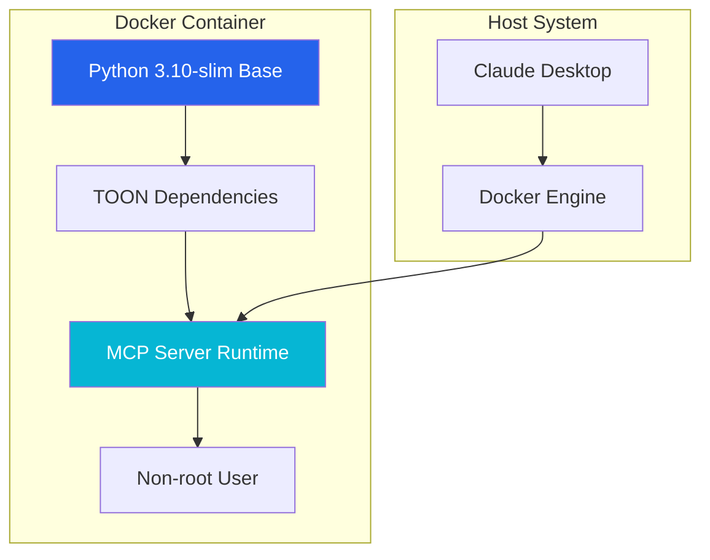

## Installation

### Prerequisites

- Python 3.10 or higher
- pip
- Git

### Step 1: Clone the Repository

```bash
git clone https://github.com/aj-geddes/toon-context-mcp.git
cd toon-context-mcp
```

### Step 2: Install Dependencies

```bash
cd mcp-server-toon
pip install -e .
```

This installs the MCP SDK, the toon-mcp-server package, and dev tools (pytest, black, ruff).

### Step 3: Verify Installation

```bash
python -c "from src.toon_converter import convert_json_to_toon; print('TOON installed successfully')"
```

---

## Docker Installation

TOON-MCP provides Docker support for containerized deployment, ensuring consistent environments and easy distribution.

### Prerequisites for Docker

- Docker 20.10 or higher
- Docker Compose (optional, for easier management)

### Building the Docker Image

```bash
# Clone the repository
git clone https://github.com/aj-geddes/toon-context-mcp.git
cd toon-context-mcp/mcp-server-toon

# Build the Docker image
docker build -t toon-mcp-server:latest .
```

### Running with Docker

```bash
# Run the server interactively
docker run -i toon-mcp-server:latest

# Run with Docker Compose (recommended)
docker-compose up -d

# View logs
docker-compose logs -f toon-mcp-server

# Stop the server
docker-compose down
```

### Docker Image Details

- **Base Image**: `python:3.10-slim` (Debian-based, not Alpine)
- **Why not Alpine?** Python performs better on Debian due to pre-built binary wheels and glibc compatibility
- **Image Size**: ~200MB (optimized with multi-layer caching)
- **Security**: Runs as non-root user (`toon`)

### Docker Architecture



### Docker MCP Configuration

To use the Dockerized TOON server with Claude Desktop:

```json
{
  "mcpServers": {
    "toon": {
      "command": "docker",
      "args": [
        "run",
        "-i",
        "toon-mcp-server:latest"
      ]
    }
  }
}
```

### Docker Compose Configuration

The included `docker-compose.yml` provides:

- Automatic restart policies
- Resource limits (512MB RAM, 1 CPU)
- Health checks
- Proper signal handling for graceful shutdown

### Container Resource Management

Default resource limits:

```yaml
# Memory limits
limits:
  memory: 512M
reservations:
  memory: 256M

# CPU limits
limits:
  cpus: '1'
reservations:
  cpus: '0.5'
```

Adjust these in `docker-compose.yml` based on your workload.

### Docker Best Practices

1. **Use tagged versions** for production: `toon-mcp-server:1.0.0`
2. **Monitor container health**: `docker ps --format "table {{.Names}}\t{{.Status}}"`
3. **Check logs regularly**: `docker logs toon-mcp-server`
4. **Update images**: Rebuild periodically for security updates

### Troubleshooting Docker Installation

**Issue**: Container exits immediately
```bash
# Check logs for errors
docker logs toon-mcp-server

# Run interactively to debug
docker run -it toon-mcp-server:latest /bin/bash
```

**Issue**: Permission denied
```bash
# Ensure Docker daemon is running
sudo systemctl start docker

# Add user to docker group (requires logout)
sudo usermod -aG docker $USER
```

**Issue**: Port conflicts
```bash
# List all running containers
docker ps -a

# Stop conflicting containers
docker stop <container-id>
```

---

## MCP Server Configuration

### Claude Desktop

Config file location:
- **macOS**: `~/Library/Application Support/Claude/claude_desktop_config.json`
- **Windows**: `%APPDATA%\Claude\claude_desktop_config.json`
- **Linux**: `~/.config/Claude/claude_desktop_config.json`

```json
{
  "mcpServers": {
    "toon": {
      "command": "python",
      "args": ["-m", "src.server"],
      "cwd": "/absolute/path/to/toon-context-mcp/mcp-server-toon"
    }
  }
}
```

<div class="alert alert-warning">
    <strong>Important</strong><br>
    The <code>cwd</code> field is required. Replace the path with the actual absolute path to the <code>mcp-server-toon/</code> directory on your system.
</div>

### Claude Code

Add to `.claude/mcp_settings.json` in your project:

```json
{
  "mcpServers": {
    "toon": {
      "command": "python",
      "args": ["-m", "src.server"],
      "cwd": "/absolute/path/to/toon-context-mcp/mcp-server-toon"
    }
  }
}
```

---

## Optional Components

### Context Manager

The `context-manager/` directory contains utilities for tracking token usage and wrapping tool outputs. These run in your own Python environment (not inside the MCP server).

```python
from context_manager.token_monitor import TokenMonitor

monitor = TokenMonitor(warn_threshold=50000, critical_threshold=100000)
monitor.analyze_message(message_content, role='user')

metrics = monitor.get_metrics()
print(f"Estimated tokens: {metrics.total_tokens:,}")
```

```python
from context_manager.tool_output_optimizer import ToolOutputOptimizer

optimizer = ToolOutputOptimizer(auto_optimize=True, min_savings=15.0)
optimized, metadata = optimizer.optimize_tool_output("file_search", tool_output)
```

To use these from outside `mcp-server-toon/`, add the repo root to your Python path:

```bash
export PYTHONPATH=/path/to/toon-context-mcp:$PYTHONPATH
```

### Auto-Converter CLI

Scan source files and replace JSON in comments, docstrings, and Markdown code blocks with TOON equivalents:

```bash
# Dry run — preview changes without writing
python claude-code-integration/auto_converter.py ./src --dry-run

# Apply with default 15% savings threshold
python claude-code-integration/auto_converter.py ./src

# Custom threshold
python claude-code-integration/auto_converter.py ./src --threshold 20
```

---

## Configuration Options

### Abbreviation Table

The built-in `KEY_ABBREV` dictionary is in `src/config.py`. To add project-specific abbreviations:

```python
# src/config.py
KEY_ABBREV = {
    # existing entries ...
    'transaction_id': 'txid',
    'account_number': 'acct',
}
```

`ABBREV_KEY` (the reverse map used for decompression) is derived automatically at import time.

### Aggressive Mode

Pass `aggressive=True` to auto-abbreviate domain-specific keys that appear 2+ times and are not in `KEY_ABBREV`:

```python
from src.toon_converter import TOONConverter

converter = TOONConverter(aggressive=True)
toon = converter.json_to_toon(data)
# Custom abbreviations stored in _custom_keys inside the payload
```

See [User Guide]({{ '/guides/user-guide' | relative_url }}) for when aggressive mode helps vs hurts.

---

## Testing Your Installation

### Basic Conversion Test

```python
from src.toon_converter import convert_json_to_toon, convert_toon_to_json
import json

data = {"id": 123, "name": "Test User", "status": "active"}

toon = convert_json_to_toon(data)
print(f"TOON: {toon}")

restored = json.loads(convert_toon_to_json(toon))
print(f"Round-trip match: {restored == data}")
```

### MCP Server Test

```bash
cd mcp-server-toon
python -m src.server
# Expected: INFO:toon-mcp-server:Starting TOON MCP Server...
```

### Run the Test Suite

```bash
cd mcp-server-toon
pytest tests/ -v
```

All 20 tests should pass.

---

## Verification Checklist

- [ ] Python 3.10+ installed
- [ ] Repository cloned
- [ ] `pip install -e .` completed without errors
- [ ] MCP config includes absolute `cwd` path
- [ ] Basic conversion test passes
- [ ] MCP server starts without errors (`python -m src.server`)
- [ ] Test suite passes (20 tests)
- [ ] Claude restarted after config change

---

Need help? Check the [Troubleshooting Guide]({{ '/guides/troubleshooting' | relative_url }}) or [open an issue](https://github.com/aj-geddes/toon-context-mcp/issues).
