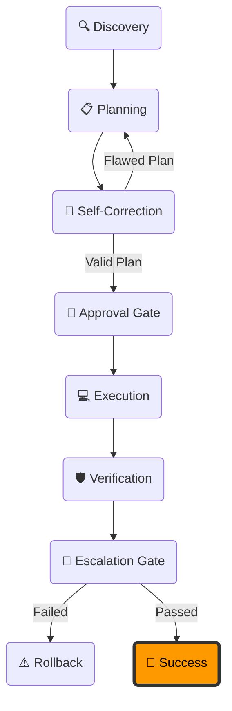

# 🛰️ Swarm Live Execution Monitor

This dashboard displays the active execution phase and handoff flows of the Antigravity Swarm.

---

## ⚡ Active Task
* **Task**: IDE Developer Session
* **Active Agent**: Orchestrator
- **Current Phase**: 🕐 Idle (12:35 PM)

---

## 📊 Live Flow Monitor

